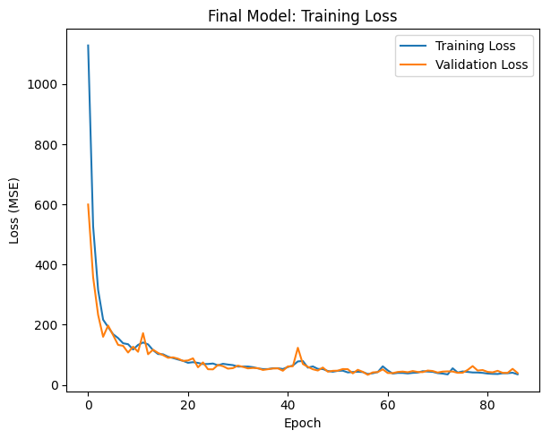
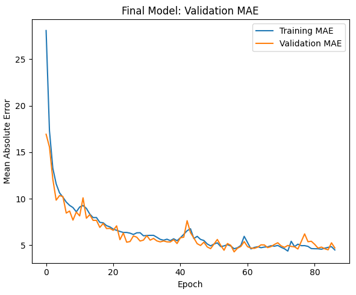
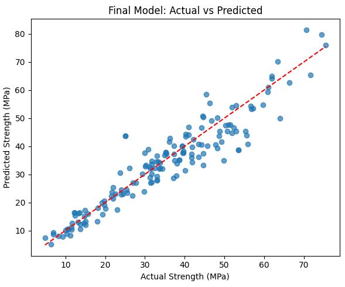

# 🧱 Smart Infrastructure: Predicting Concrete Compressive Strength using Machine Learning

This project uses machine learning to predict the **compressive strength of concrete** based on its ingredients. The model assists in optimizing mix designs, reducing material waste, and enhancing structural reliability.

## 📂 Dataset

The dataset used is the **Concrete Compressive Strength Dataset** from the UCI Machine Learning Repository. It includes 1030 samples with the following features:

- Cement (kg/m³)
- Blast Furnace Slag (kg/m³)
- Fly Ash (kg/m³)
- Water (kg/m³)
- Superplasticizer (kg/m³)
- Coarse Aggregate (kg/m³)
- Fine Aggregate (kg/m³)
- Age (days)
- **Target:** Concrete Compressive Strength (MPa)

## 🧠 Model

A simple feedforward neural network (Multilayer Perceptron) is used to learn and predict the target variable.

### 🔧 Libraries Used
- `pandas`, `numpy`
- `sklearn` for preprocessing and splitting
- `tensorflow` and `keras` for building and training the neural network
- `matplotlib` for visualization

## 📊 Evaluation

- **Loss function**: Mean Squared Error (MSE)
- **Performance Metric**: R² Score

The model shows promising accuracy in learning the non-linear relationship between ingredient proportions and concrete strength.

## 📈 Results

The model is trained over 100 epochs. Plots of loss curves and predictions versus actual values are included in the code.

## 📁 Files

- `Concrete_Data.xls`: Raw dataset
- `smart_infra_project.py`: Model building, training, and evaluation code
- `Smart_Infra_Project.pdf`: Project report with background, methodology, and conclusions

## 🚀 How to Run

1. Clone this repo:
   ```
   git clone https://github.com/your-username/smart-infra-concrete-strength.git
   cd smart-infra-concrete-strength
   ```

2. Install dependencies:
   ```
   pip install -r requirements.txt
   ```
3. Run the script:
   ```
   python smart_infra_project.py
   ```

## 📁 Project Structure
```
smart-infra-concrete-strength/
│
├── data/
│   └── Concrete_Data.xls               # Raw dataset
│
├── plots/                              # Saved training/evaluation plots (to be added)
│   ├── loss_curve.png
│   ├── mae_plot.png
│   └── prediction_vs_actual.png
│
├── smart_infra_project.py              # Full code for data preprocessing, training and optimization
├── Smart_Infra_Project.pdf             # Detailed report (includes results and explanation)
├── requirements.txt                    # List of Python dependencies
└── README.md                           # Project overview and instructions

```
## 📊 Model Summary

- **Architecture:** Feedforward Neural Network
- **Best configuration:** 3 hidden layers [128, 64, 32] with ReLU activation
- **Optimizer:** SGD with momentum
- **Evaluation Metrics:**
  - Mean Squared Error (MSE): ~29.93
  - Root Mean Squared Error (RMSE): ~5.47
  - Mean Absolute Error (MAE): ~3.98
  - R² Score: ~0.89

## 📈 Results Visualization

Training and validation progress:

>   
> *Training and Validation MSE Loss*

>   
> *Mean Absolute Error over epochs*

>   
> *Predicted vs Actual Strength*

## 🧪 Additional Features

- Learning rate schedules (step decay, cosine annealing)
- Regularization using dropout layers
- Final model saved as `concrete_strength_prediction_model.h5`
- Optimization utility to **suggest mix designs** for a **target compressive strength**

## 🧠 Potential Enhancements

- Add other ML models for comparison (Random Forest, XGBoost, etc.)
- Integrate with a simple Streamlit or Flask web app
- Use SHAP for better feature importance insights
- Make the optimizer results exportable (CSV)

## 📄 License

This project is licensed under the MIT License. See the `LICENSE` file for details.

---

## 👨‍🔬 Author

- Alok Godara   
Indian Institute of Technology, Jodhpur

---

*Feel free to fork, star ⭐, or contribute to this project!*
